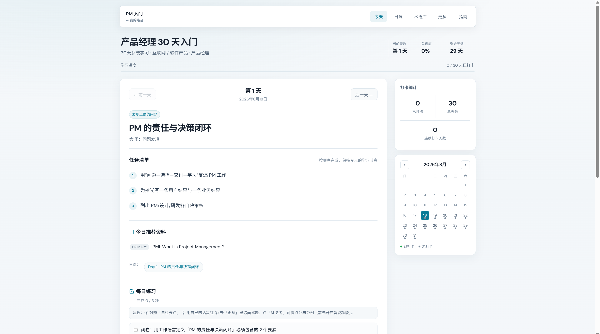
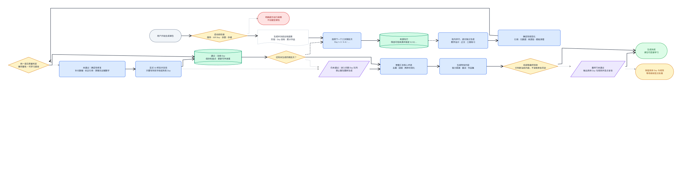

<div align="center">


# 知径

**把“想学一个岗位”，变成每天走得动的一步。**

按岗位生成学习路径，围绕任务、资料、练习、复盘和打卡形成每日闭环。

[下载最新版](https://github.com/wterenwang/zhijing/releases/latest) · [查看 v1.2.0 更新](CHANGELOG.md#120---2026-08-18) · [反馈问题](https://github.com/wterenwang/zhijing/issues)


</div>

## 为什么是知径

资料越多，不等于越容易学会。知径把岗位学习拆成可执行的日课，并让每一天都能回答五个问题：

1. 今天要完成什么任务？
2. 应该先读哪些可信资料？
3. 怎样确认自己真的理解了？
4. 哪些内容需要用自己的话复述和记录？
5. 今天是否达到可以打卡的学习底线？

你可以先体验内置的“产品经理 30 天入门”展示路径，也可以填写行业、岗位和目标，生成自己的 30 / 60 / 90 天学习路径。

## v1.2.0 界面



“今天”页围绕 **任务 → 资料 → 练习 → 复盘 → 打卡** 排列，学习进度和日历固定在侧栏；费曼复述与笔记改为标签页，减少页面跳转和视觉干扰。

## 核心能力

- **专属岗位路径**：按行业、岗位、目标和周期生成完整学习蓝图。
- **逐日学习闭环**：每日任务、可信资料、章节内容、三类练习、复盘与打卡相互对应。
- **质量门禁**：统一检查来源、引用、正文厚度、练习多样性和任务—资料证据关系。
- **断点续跑**：生成过程按微批次保存检查点，刷新、关闭或主动停止后可继续补全。
- **检索提速**：按周建立候选资料池，多个 Day 复用同一轮检索结果，降低单 Key 等待时间。
- **可读资源标题**：GitHub 文件和仓库优先显示 README 标题或项目描述，不再只展示机械文件名。
- **定点修复**：只重写失败字段或问题 Day，避免因局部问题整包重生成。
- **知识库与术语图鉴**：支持章节精读、搜索、知识图谱、术语对比和项目里程碑。
- **复习与求职工具**：包含间隔复习、面试题、作品集看板、投递管理和资讯解读。
- **九步使用指南**：引导已适配新的“今天”页、练习区和复盘标签页。

完整更新内容见 [CHANGELOG.md](CHANGELOG.md)。

## 3 分钟开始

1. 打开 [Releases](https://github.com/wterenwang/zhijing/releases/latest)。
2. 下载与你的系统匹配的安装包：
   - Windows x64：`Zhijing-Setup-1.2.0.exe`
   - macOS Apple Silicon：`Zhijing-1.2.0-mac-arm64.dmg` 或 `.zip`
3. 安装并启动“知径”。
4. 先进入展示路径体验一天，或在“我的路径”中新建自己的学习路径。
5. 如需生成课包、AI 点评和联网资料检索，在设置中配置 DeepSeek API Key。

### macOS 未签名提示

v1.2.0 的 macOS 构建未做 Apple 开发者签名。若系统阻止打开，请先在访达中右键应用并选择“打开”。仍提示损坏时，可执行：

```bash
xattr -cr "/Applications/知径.app"
```

当前仅提供 macOS Apple Silicon（arm64）安装包，不支持 Intel Mac。

## 智能功能与隐私

智能功能是可选的。配置一个 DeepSeek API Key 后，可使用：

- 专属课包生成与定点修复
- 练习点评与参考答案
- 联网资料检索和近期资讯解读

密钥和学习数据仅保存在本机，不会上传到知径自建服务器。联网功能会将完成任务所需的提示词发送至你配置的 DeepSeek 服务，并按资源链接访问 GitHub 等公开站点获取元数据。请勿在学习内容中粘贴密码、令牌或其他敏感信息。

## 课包生成方式



生成流程采用“全局蓝图 → 三天微批次 → 来源先行 → 逐日生成 → 质量验收 → 定点修复 → 最终门禁”。每个通过检查的 Day 会立即冻结并保存，因此已有合格内容不会因后续失败而丢失。

## 本地开发

要求：Node.js 22+、npm；网页版本地代理还需要 Python 3。

```bash
git clone https://github.com/wterenwang/zhijing.git
cd zhijing
npm ci
npm run test:workflow
npm start
```

常用命令：

```bash
npm run test:workflow   # 课包工作流回归测试
npm run pack            # 生成 unpacked 桌面应用
npm run dist            # 构建 Windows NSIS 安装包
npm run dist:portable   # 构建 Windows 便携版
npm run dist:mac        # 构建 macOS arm64 DMG + ZIP（需 macOS）
```

知识库前端位于 `ei-knowledge-hub/`。修改后先重新构建，再打包桌面端：

```bash
cd ei-knowledge-hub
npm ci
npm run build
cd ..
npm run dist
```

Windows 网页预览可运行 `启动本地服务.bat`，然后访问 `http://127.0.0.1:3000/index.html`。

## 项目结构

```text
.
├─ index.html                 主应用界面与交互
├─ js/                        课包、工作流、复习与页面逻辑
├─ electron/                  Electron 主进程和本地服务
├─ ai-proxy.py                网页版本地 AI / 元数据代理
├─ ei-knowledge-hub/          React + TypeScript 知识库前端
├─ hub/                       知识库构建产物
├─ test/                      工作流回归测试
├─ docs/architecture/         正式架构与流程图
└─ .github/workflows/         跨平台发布自动化
```

## 支持与限制

- Windows：x64
- macOS：Apple Silicon / arm64，未签名
- 生成与联网能力依赖用户自己的 DeepSeek API Key、账户余额和网络环境
- 默认展示课表用于体验产品，正式学习建议创建专属路径
- 不提供云端账号同步；备份与恢复由应用内本地文件完成

如遇问题，请在 [Issues](https://github.com/wterenwang/zhijing/issues) 中说明系统版本、知径版本、复现步骤和错误截图。提交日志前请先移除 API Key 与个人信息。

## 授权

Copyright © 知径。保留所有权利。

本仓库公开仅用于查看与问题反馈，未授予复制、修改、再分发、商用或创建衍生作品的许可。除非获得权利人明确书面授权，否则不得使用本项目代码或素材。
